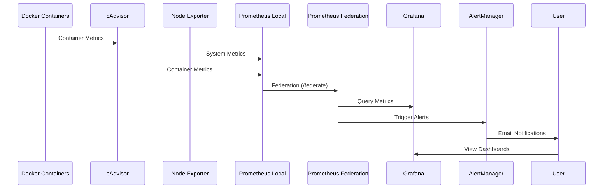
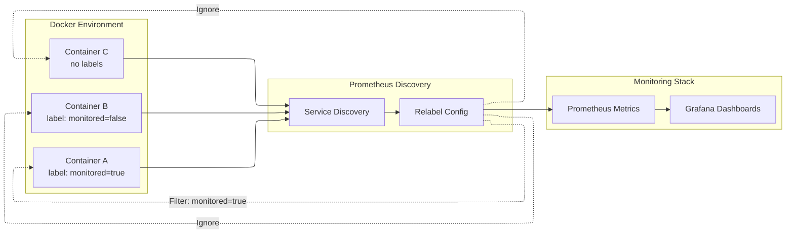

# 🚀 Docker Infrastructure Monitoring – Automated with Ansible


[](https://github.com/Sirine-bit/docker-monitoring)
[](ansible/)

---

## 📌 Overview
This project delivers a **complete monitoring and alerting solution** for Docker infrastructures.  
It evolves from **manual deployment** of monitoring tools to a **federated multi-VM architecture**, and finally to a **fully automated solution** using **Ansible** and **Vagrant**.  

The stack includes:
- **Prometheus** for time-series metrics collection  
- **Grafana** for data visualization and dashboards  
- **Node Exporter & cAdvisor** for system and container metrics  
- **Alertmanager** for alerting and notifications  
- **Ansible & Vagrant** for provisioning, orchestration, and automation  

---

## 🎯 Objectives
- Monitor Docker containers and host machines in real-time.  
- Federate metrics across multiple VMs using **Prometheus federation**.  
- Automate deployments with **Ansible roles & playbooks**.  
- Provide **dynamic Grafana dashboards** for container visibility.  
- Ensure a **scalable, portable, and reproducible infrastructure**.  

---

## 🏗️ System Architecture

### High-Level Architecture


### Data Flow Architecture



---

## 🖥️ User Interfaces

### Prometheus Federation UI


*The Prometheus federation interface showing metrics collection from multiple nodes with service discovery*

### Grafana Custom Dashboards


*System-level monitoring dashboard showing CPU, memory, and disk usage *


*Dynamic Grafana dashboard displaying real-time container metrics with custom filtering by labels*

**Features:**
- Real-time container CPU/Memory usage
- Network I/O statistics
- Container lifecycle events
- Dynamic filtering by labels


### AlertManager Configuration


*AlertManager interface showing active alerts and notification routing configuration*

**Features:**
- Active alerts overview
- Historical alert trends

---

## 📊 Monitoring Capabilities

### Container Discovery & Labeling



### Alert Configuration Matrix

| Alert Type | Threshold | Duration | Action |
|------------|-----------|----------|---------|
| High CPU Usage | >80% | 2 minutes | Email  |
| Memory Exhaustion | >90% | 1 minute | Email |
| Container Down | N/A | 30 seconds | Email 
| Federation Loss | N/A | 1 minute | Email |
| Disk Space | >85% | 5 minutes | Email |

---

## ⚙️ Technology Stack

### Core Components

| Component | Version | Purpose |
|-----------|---------|---------|
| **Docker** | 20.10+ | Container Runtime |
| **Docker Compose** | v2.x | Service Orchestration |
| **Prometheus** | 2.40+ | Metrics Collection |
| **Grafana** | 9.0+ | Data Visualization |
| **AlertManager** | 0.25+ | Alert Management |
| **Node Exporter** | 1.5+ | System Metrics |
| **cAdvisor** | 0.47+ | Container Metrics |

### Automation Stack

| Tool | Purpose | Configuration |
|------|---------|---------------|
| **Ansible** | Infrastructure Automation | Playbooks + Roles |
| **Vagrant** | VM Provisioning | Multi-VM Setup |
| **Jinja2** | Template Engine | Dynamic Configs |
| **Bash** | Automation Scripts | Container Simulation |

---

## 📂 Project Structure

```
docker-monitoring/
├── 📁 ansible/                    # Ansible automation
│   ├── ansible.cfg                 # Ansible configuratio
│   ├── 📁inventory                
│   ├── 📁playbooks
│   │   ├── cleanup.yml                # Environment cleanup
│   │   ├── deploy_infrastructure.yml  # Verify installation/install the corect version  
│   │   ├── deploy_monitoring.yml 
│   │   └── site.yml                  # Full deployment
│   │   └── smart-docker-installer.yml       
│   ├── 📁 roles/
│   │   ├── 📁 common/
│   │   ├── 📁 monitoring_stack/   
│   │   ├── 📁 prometheus_local/   
│   │   └── 📁 prometheus_federator/ 
│   ├── 📁 group_vars/
│   │   └── all.yml                # Global variables
│   └── 📁 vault/                  # security of data
├── 📁 custom-app                  # Custom app deploy
├── ├── docker-comose.yml
│   ├── alertmanager.yml
│   ├── prometheus.yml             # Main configuration for VM desktop
│   ├── federation_alert_rules.yml # Alert rules
│   ├── alert_rules.yml 
├── 📁 scripts/                    # Automation scripts           
├── 📁 vagrant/
│   └── Vagrantfile               # VM definitions
├── 📁 docs/                      # Documentation
└── README.md                     # This file
└── requirements.yml                 
```

---

## 🚀 Quick Start Guide

### 1️⃣ Prerequisites Checklist

Before starting, ensure you have:

- [ ] **VirtualBox** 6.1+ installed
- [ ] **Vagrant** 2.2+ installed  
- [ ] **Ansible** 4.0+ installed
- [ ] **Git** for version control
- [ ] **8GB+ RAM** available for VMs
- [ ] **20GB+ disk space** available

### 2️⃣ Clone & Initialize

```bash
# Clone the repository
git clone https://github.com/Sirine-bit/docker-monitoring.git
cd docker-monitoring
docker compose down
docker comopse up -d
```

### 3️⃣ VM Provisioning

```bash
# Navigate to Vagrant directory
cd vagrant/

# Start all VMs (this may take 10-15 minutes)
vagrant up

# Check VM status
vagrant status
```

### 4️⃣ Ansible Deployment

```bash
# Navigate to Ansible directory
cd ../ansible/

# Test connectivity
ansible all -m ping -i inventory/dev/hosts.yml

# # Deploy the complete stack via Ansible
ansible-playbook -i inventory/dev/hosts.yml playbooks/site.yml
```

### 5️⃣ Access Services

| Service | URL | Credentials |
|---------|-----|-------------|
| **Grafana** | http://localhost:3000 | admin / admin |
| **Prometheus** | http://localhost:9090 | - |
| **AlertManager** | http://localhost:9093 | - |

---

## 🔧 Configuration Management

### Ansible Role Structure

```mermaid
flowchart TB
 subgraph subGraph0["Ansible Role Structure"]
        CR["common<br>📦 System prep for VM desktop"]
        SDI["smart-docker-installer(playbook)<br>🐳 Docker setup"]
        PF["prometheus_federator<br>🌐 Federation"]
        MS["monitoring_stack<br>📊 Complete stack"]
        PL["prometheus_local<br>🎯 Local metrics for each VM server"]
        n1["deploy_monitoring (playbook)"]
  end
 subgraph Templates["Templates"]
        T1["prometheus.yml.j2"]
        T2["docker-compose.yml.j2"]
        T3["alertmanager.yml.j2"]
        T4["alert-rules.yml.j2"]
        T5["grafana-datasource.yml.j2"]
  end
    MS --> T1 & T2 & T3 & PF & T4
    PF --> T5
    CR --> MS
    SDI --> n1
    n1 --> PL & CR

    style CR stroke:#2962FF
    style PF stroke:#2962FF
    style MS stroke:#2962FF
    style PL stroke:#2962FF

```



### Environment Variables

```yaml
# group_vars/all.yml
monitoring:
  prometheus:
    version: "v2.40.0"
    port: 9090
    retention: "30d"
  
  grafana:
    version: "9.3.0"
    port: 3000
    admin_password: "{{ vault_grafana_password }}"
  
  network:
    subnet: "192.168.56.0/24"
    gateway: "192.168.56.1"

federation:
  central_node: "192.168.56.10"
  worker_nodes:
    - "192.168.56.11"
    - "192.168.56.12"
```

---

## 🚨 Alert Configuration

### Alert Rules Examples

```yaml
# High CPU Usage Alert
- alert: HighCPUUsage
  expr: 100 - (avg by(instance) (irate(node_cpu_seconds_total{mode="idle"}[5m])) * 100) > 80
  for: 2m
  labels:
    severity: warning
  annotations:
    summary: "High CPU usage detected"
    description: "CPU usage is above 80% for more than 2 minutes"

# Container Down Alert  
- alert: ContainerDown
  expr: up{job="monitored-containers"} == 0
  for: 30s
  labels:
    severity: critical
  annotations:
    summary: "Container is down"
    description: "Container {{ $labels.instance }} has been down for 30 seconds"

# Federation Failure Alert
- alert: FederationDown
  expr: up{job="federation"} == 0
  for: 1m
  labels:
    severity: critical
  annotations:
    summary: "Prometheus federation is down"
    description: "Cannot scrape metrics from {{ $labels.instance }}"
```

---

## 🔍 Troubleshooting Guide

### Common Issues & Solutions

<details>
<summary><strong>🐳 Docker Issues</strong></summary>

**Problem:** Docker Compose v1 vs v2 compatibility
```bash
# Solution: Force Docker Compose v2
docker compose version
# If v1, install v2 juste execute:
ansible-playbook -i inventory/dev/hosts.yml playbooks/smart-docker-installer.yml
```

**Problem:** Permission denied on Docker socket
```bash
# Solution: Add user to docker group
sudo usermod -aG docker $USER
newgrp docker
```
</details>

<details>
<summary><strong>📊 Prometheus Issues</strong></summary>

**Problem:** YAML syntax errors in prometheus.yml
```bash
# Solution: Validate YAML syntax
yamllint prometheus/prometheus.yml
# Fix indentation and restart
docker compose restart prometheus
```

**Problem:** Scrape targets showing as DOWN
```bash
# Check network connectivity
docker network ls
docker network inspect monitoring_default
# Verify service ports
docker compose ps
```
</details>

<details>
<summary><strong>🌐 Federation Issues</strong></summary>

**Problem:** Federation endpoint not accessible
```bash
# Check federation endpoint
curl http://192.168.56.11:9090/federate?match[]={__name__=~".+"}
# Verify firewall settings
sudo ufw status
sudo ufw allow 9090/tcp
```
</details>

---

## 📈 Performance Metrics

### Resource Usage

| Component | CPU Usage | Memory | Disk I/O |
|-----------|-----------|---------|----------|
| Prometheus | ~100MB RAM | ~200MB | Low |
| Grafana | ~80MB RAM | ~150MB | Low |
| Node Exporter | ~20MB RAM | ~30MB | Minimal |
| cAdvisor | ~50MB RAM | ~100MB | Low |

### Scalability Benchmarks

- **Max Containers Monitored:** 500+ per node
- **Metrics Retention:** 30 days default
- **Query Response Time:** <100ms (average)
- **Federation Latency:** <500ms between nodes

---

## 🗺️ Roadmap

### Phase 1: Foundation ✅
- [x] Basic monitoring stack
- [x] Docker service discovery  
- [x] Ansible automation
- [x] Multi-VM federation

### Phase 2: Enhancement 🚧  
- [ ] Kubernetes integration
- [ ] Advanced alerting (Slack, Teams)
- [ ] Log aggregation (ELK stack)
- [ ] Performance optimization

### Phase 3: Enterprise 📋
- [ ] RBAC implementation
- [ ] Multi-tenancy support  
- [ ] High availability setup
- [ ] Disaster recovery

### Phase 4: Intelligence 🤖
- [ ] ML-based anomaly detection
- [ ] Predictive scaling
- [ ] Auto-remediation workflows
- [ ] ChatOps integration

---

### Development Setup

```bash
# Fork the repository
git clone https://github.com/Sirine-bit/docker-monitoring.git

# Create a feature branch
git checkout -b feature/amazing-feature

# Make your changes and commit
git commit -m "Add amazing feature"

# Push to your fork and create a Pull Request
git push origin feature/amazing-feature
```

✅ Achievements

-  Fully automated monitoring stack

-  Prometheus federation between multiple VMs

- Custom Grafana dashboards with dynamic filtering

- Ansible-based reproducible deployments

- Scalable and production-ready design

---

## 👨‍💻 Author

**Sirine Makni** - *Engineering Student @ SUP'COM, Tunis*

[
[


